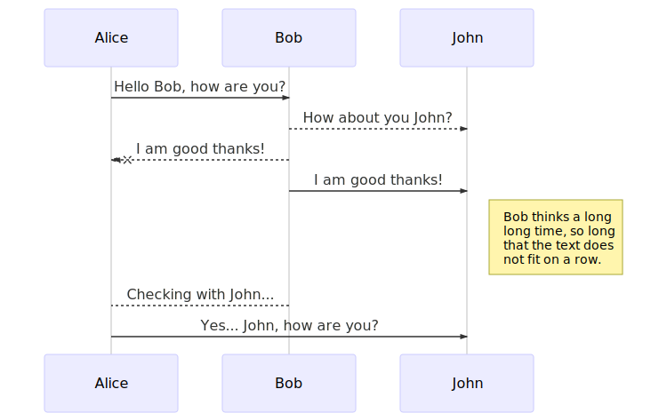
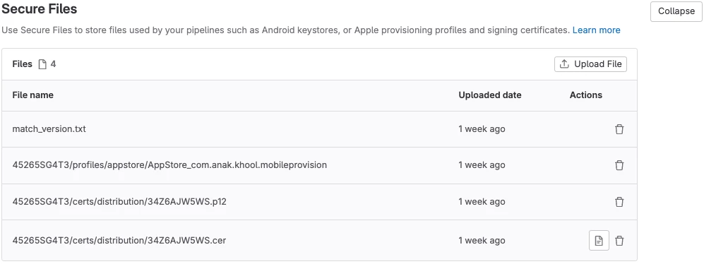

# Enable continuous store delivery on React Native for iOS and Android with Fastlane, Gitlab CI and react-native-config

A brief encounter of the third type. This is an attempt.



## Context and reasoning

Continuous delivery is a powerful tool that helps your team automate your app distribution without the tedious manual builds that make you lose a considerable amount of time. In fact, compared to a team that manually delivers their apps at the end of every development cycle, a continuous delivery workflow enabled team is proved to make them \[highly performant]\([Evidence and case studies - Continuous Delivery](https://continuousdelivery.com/evidence-case-studies/#research)). I have experienced this radical shift in mindset first hands when I helped implement for one of my squads the following complete workflow.

###

### Pre-requisites

* A working **Gitlab** installation, whether it is self hosted or a gitlab hosted

* A **react-native** app that builds both on iOS and Android. This setup was done on React-Native 0.73.6

* A machine with **brew** installed, **ruby** and **gem** (both are already present if you're using any recent mac version)

## Installations

* **Fastlane** is available via brew

  ```shell
  brew install fastlane
  ```

* *Typical React-Native cli tools*

##

## Local configuration

Let's start by making Fastlane work locally for building and uploading a beta application to both the App Store and Google Play Store.

### iOS

First head to your ios folder inside the app:

```sh
cd ios
```

1. **Init fastlane** Fastlane will create a folder and initialize the necessary files

   ```bash
   fastlane init
   ```

2. **Init fastlane match** *Fastlane Match* is a convenient way of sharing Apple certificates and provisioning profiles across a team without the hassle of creating a distinct set of files for each and every member. *Fastlane* stores the generated files on a remote folder (the default option is a secured git repository). Since we are on Gitlab we'll be using a handy feature that this platform offers: ***secure files***.

3. Setup *Gitlab* repository cert files

    If you have a self hosted Gitlab installation via Helm, enable

   

   ```yml
   global:
   common:
     ...
     ciSecureFiles:
       enabled: true
   ```

4.

## Configure Fastlane for Android

## Configure Gitlab

```
```

## Wrapping up

When used with Gitlab CI, Fastlane can be a powerful tool to automate the delivery of your React-Native app to the stores, but one should note the setup process is not straightforward, whether it's the local configuration or the remote operations. Hopefully you can kickstart your own easily with my trials and errors.

I wish there is a better tool that is more modern and more comprehensive than fastlane, as its language itself (ruby) is not familiar to a regular React-Native developer.

## Inspirations and references

*
